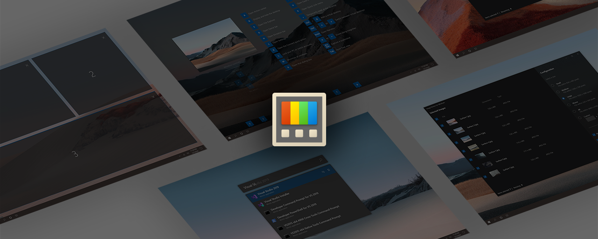
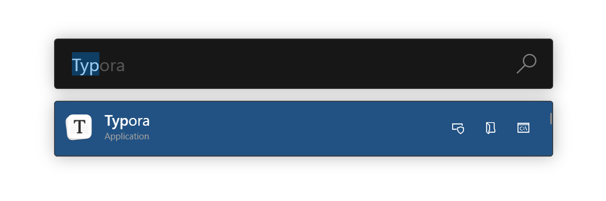

# Windows Tips

Hello everyone, this readme aims to share with you the tools I use on a daily basis on W10 to improve the user experience:

#### Tool n°1

[PowerToys](https://docs.microsoft.com/en-us/windows/powertoys/) s an open source application that uses keyboard shortcuts to launch windows add-ons that integrate seamlessly with the W10 environment and enhance the user experience.

For example, here is the "PowerRun" bar which allows quick access to applications, visual studio code workspaces, windows services, with just alt + space shortcut: 

Here is the link to the github where you can discover the many other tools of PowerToys:

https://github.com/microsoft/PowerToys

#### Tool n°2

[Search Deflector](https://github.com/spikespaz/search-deflector) is a tool developed by [Jacob Birkett](https://github.com/spikespaz) that allows you to **divert** the **internet queries** made by **cortana** or the **W10 search bar** to your **favorite web browser** armed with your **favorite search engine.**

Link :

https://github.com/spikespaz/search-deflector

